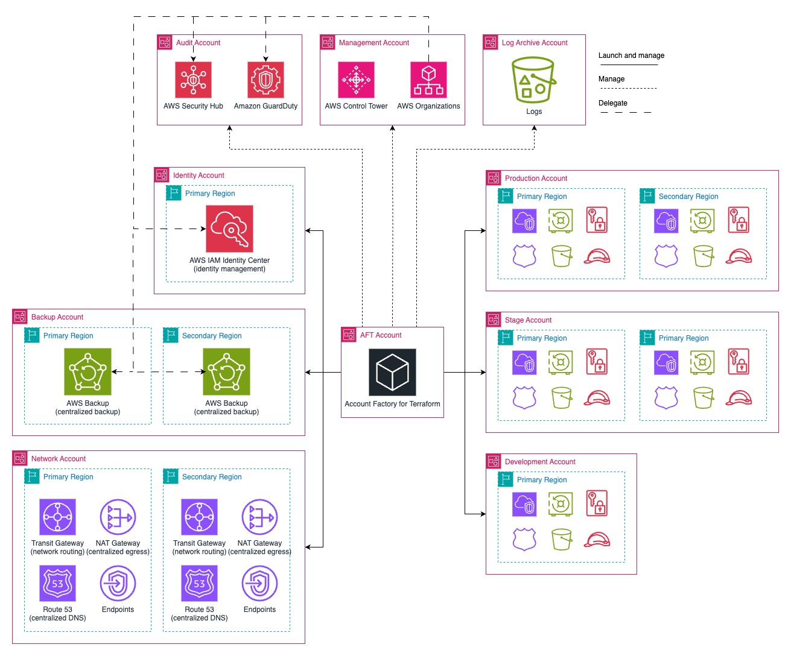

# Multi region basic pattern

The **multi region basic** AFT pattern provides a foundational cloud architecture, covering key services and configurations to establish a secure, multi-environment landing zone in multiple AWS Region. See the high-level target state diagram below.

## Network

At the core of the network design is a multi-region configuration, with cross-region communication facilitated through Transit Gateway peering. The pattern also features a centralized [Amazon Virtual Private Cloud](https://docs.aws.amazon.com/whitepapers/latest/ec2-networking-for-telecom/amazon-virtual-private-cloud.html) (VPC) using a [NAT Gateway](https://docs.aws.amazon.com/vpc/latest/userguide/vpc-nat-gateway.html), along with segregated environments for shared services, production, staging, and development. Ingress traffic is distributed and managed within each workload VPC on its public subnet.

Traffic between the workload environments (prod, stage, dev) is isolated and not routed, while traffic to/from the shared services environment (DNS, VPC endpoints, infrastructure services, etc.) is routed to all other environments. All VPCs make use of a local [VPC Flow Logs](https://docs.aws.amazon.com/vpc/latest/userguide/flow-logs.html) mechanism, sending traffic logs to a [CloudWatch Log Group](https://docs.aws.amazon.com/AmazonCloudWatch/latest/logs/Working-with-log-groups-and-streams.html), and optionally can send traffic logs to an [S3 bucket](https://docs.aws.amazon.com/AmazonS3/latest/userguide/UsingBucket.html) in the [Control Tower's Log Archive account](https://docs.aws.amazon.com/controltower/latest/userguide/shared-account-resources.html#log-archive-resources).

The pattern also includes a centralized endpoints VPC to provide a cost-effective way to manage [AWS endpoint services](https://docs.aws.amazon.com/whitepapers/latest/aws-privatelink/what-are-vpc-endpoints.html) powered by [AWS PrivateLink](https://docs.aws.amazon.com/vpc/latest/privatelink/what-is-privatelink.html). This VPC also includes a centralized [Amazon Route 53 Resolver](https://docs.aws.amazon.com/Route53/latest/DeveloperGuide/resolver.html) endpoints, which combined with Amazon Route 53 Resolver rules provide a centralized DNS resolution mechanism.

The centralized DNS resolution architecture implemented by this pattern, provides a hybrid integration between [Amazon Route 53 Private Hosted Zones](https://docs.aws.amazon.com/Route53/latest/DeveloperGuide/hosted-zones-private.html) (PHZ) and third-party DNS servers, enabling a bi-directional resolution mechanism. Moreover, this architecture also allows delegate for the delegation of "child" PHZs to each workload account, enabling individual teams to managed their DNS zones while still maintaining the DNS resolution across the entire organization.

Additionally, to enable effective IP management integrated with AWS services, the Network account is used as the delegated administrator of the [AWS VPC IP Address Manager](https://docs.aws.amazon.com/whitepapers/latest/ec2-networking-for-telecom/vpc-ip-address-manager-ipam.html) (IPAM) for the entire organization. Different IP pools are created for each environment mentioned above, making it easier to control and manage IP addresses and routing domains.

The entire network architecture is mirrored across all regions, ensuring that each region has the same services and resources implemented.

See more details in the [Network Advanced](../../docs/architectures/network-advanced.md){:target="_blank"} and [Centralized DNS](../../docs/architectures/centralized-dns.md){:target="_blank"} architecture pages.

## Backup

The pattern also includes a centralized backup architecture with local vaults and a central vault in a dedicated [AWS Backup](https://docs.aws.amazon.com/aws-backup/latest/devguide/whatisbackup.html) account, providing consolidated backup management and recovery across the environments.

See more details in the [Centralized AWS Backup](../../docs/architectures/aws-backup.md){:target="_blank"} architecture page.

## Identity Management

Additionally, the pattern sets up a delegated administrator account for the [AWS IAM Identity Center](https://docs.aws.amazon.com/singlesignon/latest/userguide/what-is.html) and [IAM Access Analyzer](https://docs.aws.amazon.com/IAM/latest/UserGuide/what-is-access-analyzer.html) services. This includes a Terraform-based pipeline to dynamically deploy and manage [Permission Sets](https://docs.aws.amazon.com/singlesignon/latest/userguide/permissionsetsconcept.html), and an analyzer for external access analysis at organization level.

See more details in the [Identity Management](../../docs/architectures/identity-management.md){:target="_blank"} architecture page.

## Security

All the patterns include the same configuration for basic AWS Security services, such as [AWS Security Hub](https://docs.aws.amazon.com/securityhub/latest/userguide/what-is-securityhub.html) and [Amazon GuardDuty](https://docs.aws.amazon.com/guardduty/latest/ug/what-is-guardduty.html).

See more details in the [Security Services](../../docs/architectures/security.md){:target="_blank"} architecture page.

## Global Customizations

This pattern also includes global customizations that are applied across all accounts. These encompass the definition of the [password policy for IAM users](https://docs.aws.amazon.com/IAM/latest/UserGuide/id_credentials_passwords_account-policy.html), as well as account-level configurations such as [S3 Block Public Access](https://docs.aws.amazon.com/AmazonS3/latest/userguide/access-control-block-public-access.html), [AMI Block Public Access](https://docs.aws.amazon.com/AWSEC2/latest/UserGuide/block-public-access-to-amis.html), [EBS account-level encryption enforcement](https://docs.aws.amazon.com/ebs/latest/userguide/encryption-by-default.html), and [IMDSv2 account-level enforcement](https://docs.aws.amazon.com/AWSEC2/latest/UserGuide/configuring-IMDS-new-instances.html#set-imdsv2-account-defaults).

## Account Provisioning Customizations

No account provisioning customizations other than the AFT default are available for this pattern.
