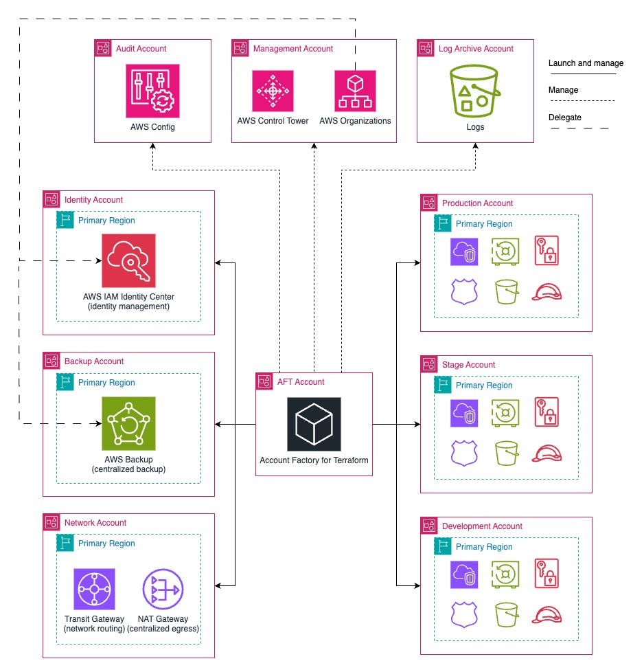

# Single region basic pattern

The **single region basic** AFT pattern provides a foundational cloud architecture, covering key services and configurations to establish a secure, multi-environment landing zone in a single AWS Region. See the high-level target state diagram below.

## Network

The network design features a centralized egress [Amazon Virtual Private Cloud](https://docs.aws.amazon.com/whitepapers/latest/ec2-networking-for-telecom/amazon-virtual-private-cloud.html) (VPC) using a [NAT Gateway](https://docs.aws.amazon.com/vpc/latest/userguide/vpc-nat-gateway.html), along with segregated environments for shared services, production, staging, and development. Ingress traffic is distributed and managed within each workload VPC on its public subnet.

The traffic between the workload environments (prod, stage, dev) is isolated and not routed, while traffic to/from the shared services environment is routed to all other environments. All VPCs make use of a local [VPC Flow Logs](https://docs.aws.amazon.com/vpc/latest/userguide/flow-logs.html) mechanism, sending traffic logs to an [S3 bucket](https://docs.aws.amazon.com/AmazonS3/latest/userguide/UsingBucket.html) in the account itself.

Additionally, to enable effective IP management integrated with AWS services, the Network account is used as the delegated administrator of the [AWS VPC IP Address Manager](https://docs.aws.amazon.com/whitepapers/latest/ec2-networking-for-telecom/vpc-ip-address-manager-ipam.html) (IPAM) for the entire organization. Different IP pools are created for each environment mentioned above, making it easier to control and manage IP addresses and routing domains.

See more details in the [Network Basic](../../docs/architectures/network-basic.md){:target="_blank"} architecture page.

## Backup

The pattern also includes a centralized backup architecture with local vaults and a central vault in a dedicated [AWS Backup](https://docs.aws.amazon.com/aws-backup/latest/devguide/whatisbackup.html) account, providing consolidated backup management and recovery across the environments.

See more details in the [Centralized AWS Backup](../../docs/architectures/aws-backup.md){:target="_blank"} architecture page.

## Identity Management

Additionally, the pattern sets up a delegated administrator account for the [AWS IAM Identity Center](https://docs.aws.amazon.com/singlesignon/latest/userguide/what-is.html) and [IAM Access Analyzer](https://docs.aws.amazon.com/IAM/latest/UserGuide/what-is-access-analyzer.html) services. This includes a Terraform-based pipeline to dynamically deploy and manage [Permission Sets](https://docs.aws.amazon.com/singlesignon/latest/userguide/permissionsetsconcept.html), and an analyzer for external access analysis at organization level.

See more details in the [Identity Management](../../docs/architectures/identity-management.md){:target="_blank"} architecture page.

## Security

All the patterns include the same configuration for basic AWS Security services, such as [AWS Security Hub](https://docs.aws.amazon.com/securityhub/latest/userguide/what-is-securityhub.html) and [Amazon GuardDuty](https://docs.aws.amazon.com/guardduty/latest/ug/what-is-guardduty.html).

See more details in the [Security Services](../../docs/architectures/security.md){:target="_blank"} architecture page.

## Global Customizations

This pattern also includes global customizations that are applied across all accounts. These encompass the definition of the [password policy for IAM users](https://docs.aws.amazon.com/IAM/latest/UserGuide/id_credentials_passwords_account-policy.html), as well as account-level configurations such as [S3 Block Public Access](https://docs.aws.amazon.com/AmazonS3/latest/userguide/access-control-block-public-access.html), [AMI Block Public Access](https://docs.aws.amazon.com/AWSEC2/latest/UserGuide/block-public-access-to-amis.html), [EBS account-level encryption enforcement](https://docs.aws.amazon.com/ebs/latest/userguide/encryption-by-default.html), and [IMDSv2 account-level enforcement](https://docs.aws.amazon.com/AWSEC2/latest/UserGuide/configuring-IMDS-new-instances.html#set-imdsv2-account-defaults).

## Account Provisioning Customizations

No account provisioning customizations other than the AFT default are available for this pattern.
